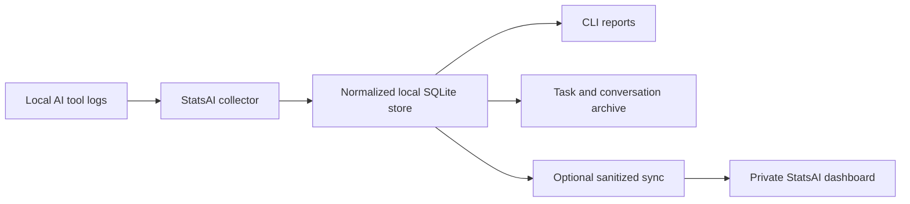

<p align="center">
  
</p>

<h1 align="center">StatsAI</h1>

<p align="center">
  <strong>Know what your AI coding tools actually cost.</strong>
</p>

<p align="center">
  Local-first analytics for AI-assisted development. Bring usage from Claude Code,
  Codex, OpenCode, and Grok Build into one private, consistent view.
</p>

<p align="center">
  <a href="https://statsai.dev">Website</a> ·
  <a href="https://statsai.dev/docs/">Documentation</a> ·
  <a href="https://github.com/starkdmi/statsai/releases">Releases</a>
</p>

<p align="center">
  <a href="https://github.com/starkdmi/statsai/releases"></a>
  <a href="https://crates.io/crates/statsai"></a>
  <a href="./LICENSE"></a>
</p>

---

AI coding tools make it easy to spend tokens across different providers,
accounts, projects, and machines—and surprisingly hard to understand the total.
StatsAI reads the logs those tools already keep, normalizes them locally, and
turns them into useful answers:

- Which tools, models, projects, and devices use the most tokens?
- What would that usage cost at API-equivalent prices?
- Is a subscription delivering more value than its monthly price?
- What work did those sessions contribute to?
- How is usage changing over time?

No provider API keys. No request proxy. Your raw logs stay on your machine.

> [!NOTE]
> StatsAI is under active development. The CLI is usable today, but its public
> API and data model may still change before 1.0.

## What you get

| | Capability | Value |
|---|---|---|
| 📊 | **One usage model** | Compare providers, models, accounts, projects, and devices without reconciling incompatible reports. |
| 💸 | **Cost and subscription context** | Estimate API-equivalent cost and compare it with time-bounded subscription periods. |
| 🔒 | **Local-first collection** | Parse, normalize, store, and report on usage locally in SQLite. |
| 🧭 | **Work and conversation history** | Rebuild task spans and preserve a provider-independent, searchable local conversation archive. |
| ☁️ | **Optional private dashboard** | Sync sanitized rollups from multiple machines to [statsai.dev](https://statsai.dev). |
| 🧩 | **CLI, SDK, and daemon** | Use StatsAI interactively, embed it in Rust, or power local widgets through a loopback API. |

## How it works



StatsAI discovers supported local sources, converts their records into a common
schema, and writes them idempotently. Repeated scans use a lightweight file
signature cache, so unchanged history is skipped while active logs stay current.

## Quick start

### 1. Install

On macOS with Homebrew:

```sh
brew install starkdmi/tap/statsai
```

Or use the release installer:

```sh
curl -LsSf https://github.com/starkdmi/statsai/releases/latest/download/statsai-installer.sh | sh
```

You can also install the published Rust crate:

```sh
cargo install statsai
# or
cargo binstall statsai
```

GitHub Releases include a universal macOS CLI archive and `StatsAI.app`.

### 2. Preview your local usage

Preview reads the default provider locations without writing to SQLite:

```sh
statsai scan --preview
```

Limit the scan to one provider when needed:

```sh
statsai scan --provider codex --preview
```

You will see a normalized summary similar to:

```text
codex account=work path=~/.codex-work usage_events=123 input=1,000,000 cached=800,000 output=20,000 total=1,030,000 est_cost=$1.23
```

### 3. Save and report

```sh
statsai scan
statsai report weekly
statsai report monthly
statsai report all-time
statsai report range --from 2026-01-01 --to 2026-03-31
```

Scans are idempotent: running the same scan again refreshes improved metadata
without duplicating usage events.

### 4. Optionally connect the dashboard

```sh
statsai auth login
statsai sync --sink http --since-last
```

Normal login opens [statsai.dev](https://statsai.dev) to approve the device. For
a remote or headless machine:

```sh
statsai auth login --headless --device-name "Build server"
```

## Privacy by design

StatsAI separates local evidence from the smaller dataset needed for a hosted
dashboard.

| Stays local | Can be included in hosted sync |
|---|---|
| Complete prompts, model responses, and archived conversations | Daily token and request rollups |
| Raw provider log lines | Provider, model, and account metadata |
| Parse evidence and local source paths | Project labels and repository anchors |
| Source text, diffs, file paths, and commit messages | Privacy-safe numeric code-change metrics |
| — | Opt-in private task snapshots and verifications, including bounded task titles, summary previews, and todo excerpts |

Raw usage events and complete archived conversation records stay local and are
never included in hosted sync. StatsAI does not upload full prompts, full
responses, or raw provider logs. When hosted task sync is explicitly enabled
with `statsai sync --include-tasks`, the current `sync_batch.v3` payload may
include bounded conversation-derived task titles, summary previews, and todo
excerpts. You can inspect the exact sync contract in
[`docs/sync-contract.md`](docs/sync-contract.md) and verify the resolved sync
target with:

```sh
statsai sync --sink http --verify
```

StatsAI can also create a separate, local pseudonymized dataset from archived
conversations. This is an explicit operation—not part of normal scanning or
sync:

```sh
statsai privacy setup --help
statsai privacy filter
statsai privacy status
```

Privacy setup requires paths to the MLX server, MLX model, and Kingfisher
helper. Run `statsai privacy setup --help` for the current asset options before
filtering.

Statistical detectors can miss sensitive content, so filtered data should be
treated as pseudonymized rather than anonymous.

## Supported local sources

| Provider | Default locations |
|---|---|
| Claude Code | `~/.config/claude`, `~/.claude` |
| Codex | `~/.codex` |
| OpenCode | `~/.local/share/opencode` |
| Grok Build | `~/.grok` |

Add non-default locations explicitly:

```sh
statsai source add --provider codex --path "$HOME/.codex-work"
statsai source list
```

OpenCode and Grok Build also support `OPENCODE_DATA_DIRS`,
`GROK_DATA_DIRS`, and `GROK_HOME` for automation.

## Go beyond token totals

### Connect accounts and subscriptions

Map a source to the account that was active during a specific period:

```sh
statsai source connect \
  --path "$HOME/.codex-work" \
  --email work@example.com \
  --label work \
  --started-at 2026-05-01
```

Then register subscription periods to add value context to reports:

```sh
statsai subscription add \
  --provider codex \
  --email work@example.com \
  --plan Pro \
  --price 20 \
  --started-at 2026-05-01 \
  --paid-at 2026-05-01

statsai report monthly --subscriptions
```

Canonical accounts are created when an identity such as `--email`,
`--provider-user-id`, or `--provider-account-id` is first used. Labels such as
`work` and `personal` are display metadata, not account identity.

For Claude Code sources in `auto` verification mode, StatsAI reads only
`oauthAccount.accountUuid`, `oauthAccount.emailAddress`, and
`oauthAccount.profileFetchedAt` from the local `.claude.json` profile. It does
not invoke the Claude CLI or contact a service. This is reported as an
`inferred` identity because Claude transcripts do not record per-session
credential provenance. Durable API-key, token, cloud-provider, gateway, and
credential-helper settings in managed, user, and project scopes suppress the
inference. Missing session indexes are recovered from bounded transcript
metadata when possible; otherwise attribution fails closed. One-shot environment
overrides cannot be reconstructed by file-only collection, so `auto` is a
best-effort source-wide policy. Use `manual_only` plus explicit source connections
for mixed-credential history.

### Understand the work behind the usage

Ask a scan to extract local task spans and rebuild derived work items:

```sh
statsai scan --include-tasks
statsai task list
statsai task show work_123 --include-evidence
statsai task verify accept work_123
statsai task benchmark
```

The benchmark becomes a meaningful quality gate after you record verified
ground truth. See [`docs/task-collection.md`](docs/task-collection.md) and
[`docs/task-benchmarking.md`](docs/task-benchmarking.md).

### Keep a durable conversation archive

Collect complete conversations into the local SQLite store, then search or
export them independently of the original provider format:

```sh
statsai conversation collect --provider codex
statsai conversation search "database AND migration"
statsai conversation show conv_123
statsai conversation export conv_123 --format json
statsai conversation stats
```

Collection is additive and incremental. StatsAI retains visible messages,
readable reasoning, and referenced artifacts within documented size limits.
Opaque encrypted reasoning is ignored. See
[`docs/conversation-archive.md`](docs/conversation-archive.md) for retention and
completeness guarantees.

### Fill gaps without double-counting

When raw history is missing, import aggregate usage as reported evidence:

```sh
statsai import summary \
  --path ./reported_usage_summaries.json \
  --dry-run \
  --verbose
```

Imported summaries remain separate from trusted local events and appear as
“summary reports (not added to event totals).”

## CLI reference

<details>
<summary><strong>Source and account management</strong></summary>

```sh
statsai source list
statsai source add --provider codex --path "$HOME/.codex-work"
statsai source history --path "$HOME/.codex-work"
statsai source connect --path "$HOME/.codex-work" --email work@example.com --started-at 2026-05-01
statsai source disconnect --path "$HOME/.codex-work" --email work@example.com --ended-at 2026-06-01
statsai source disable --source-id src_123
statsai source enable --source-id src_123
statsai source remove --source-id src_123
statsai source remove --source-id src_123 --delete-data
statsai account list
```

`source remove` deletes only the configuration unless `--delete-data` is
provided. With that flag it also removes linked local events, summaries,
rollups, and scan-cache entries.

</details>

<details>
<summary><strong>Scanning and reporting</strong></summary>

```sh
statsai scan --preview
statsai scan --provider opencode --preview
statsai scan --provider grok-build --preview
statsai scan --no-cache
statsai scan --replace
statsai report weekly
statsai report monthly --subscriptions
statsai report all-time --json --verbose
statsai report range --from 2026-01-01 --to 2026-03-31
statsai report range --from 2026-05-01 --json
```

Normal scans use a per-source file signature cache. `--no-cache` forces a
one-off reread; `--replace` performs a destructive source rebuild.

JSONL input is streamed with a 16 MiB per-record ceiling. Invalid or oversized
records are counted and discarded through the next newline, after which parsing
continues.

</details>

<details>
<summary><strong>Subscriptions, tasks, and conversations</strong></summary>

```sh
statsai subscription add --provider claude --email personal@example.com --plan Pro --price 20 --started-at 2026-05-15 --paid-at 2026-05-15
statsai subscription change --provider codex --email work@example.com --plan Pro --price 200 --started-at 2026-06-01
statsai task list
statsai task show work_123 --include-evidence
statsai task verify accept work_123
statsai task benchmark
statsai task export --level span --format jsonl
statsai conversation collect --provider codex --verbose
statsai conversation list
statsai conversation search "database AND migration"
statsai conversation show conv_123
statsai conversation export conv_123 --format json
statsai conversation stats
```

</details>

<details>
<summary><strong>Authentication and sync</strong></summary>

```sh
statsai auth login
statsai auth login --no-open
statsai auth login --headless --device-name "Mini server"
statsai auth status
statsai sync --sink file --output ./statsai-sync-batch.json
statsai sync --sink http --since-last
statsai sync --sink http --verify
statsai sync --status
statsai schema sync-batch
```

HTTP sync uses the stored device session unless `--auth-token` or
`STATSAI_SYNC_TOKEN` is provided. Access tokens are refreshed automatically.

</details>

## Local integrations

### Loopback daemon

The daemon binds to loopback for local widgets and toolbar integrations.
`/health` is public; every other route requires the per-install bearer token
stored at `~/.statsai/daemon-token`.

```sh
curl -H "Authorization: Bearer $(cat ~/.statsai/daemon-token)" \
  http://127.0.0.1:8765/accounts
```

Browser-originated requests are rejected. Sync writes must use
`Content-Type: application/json` and stay below 8 MiB.

### Rust SDK

`crates/statsai-sdk` exposes a facade for embedding collection and reporting in
Rust applications. The backend-facing sync boundary begins at
`sync_batch.v1`; use `statsai schema sync-batch` to inspect it.

## Architecture

| Crate | Responsibility |
|---|---|
| `statsai-core` | Normalized types, stable IDs, schemas, and privacy metadata |
| `statsai-adapters` | Claude Code, Codex, OpenCode, and Grok Build adapters |
| `statsai-store` | Local SQLite persistence |
| `statsai-pricing` | Time-aware provider pricing and API-equivalent estimates |
| `statsai-privacy` | Local privacy filtering and pseudonymization |
| `statsai-sync` | Pluggable stdout, file, and HTTP sync sinks |
| `statsai-daemon` | Authenticated loopback API |
| `statsai-sdk` | Rust SDK facade |
| `statsai` | Command-line application |
| `statsai-menubar` | macOS menu bar application |

Local paths are hashed in source identity fields. Source and parse-evidence path
labels are stripped from sync payloads, while project location labels can be
retained for owner-facing project linking.

Cost figures are API-equivalent estimates, not subscription invoices. StatsAI
selects published pricing by usage timestamp, preserves integer micro-USD
values, and leaves cost unknown when a source does not prove the billable model.

## Develop locally

This is a Rust workspace. Run the same checks used in CI:

```sh
./scripts/rust-ci.sh full
```

Install repository-local hooks for formatting and Clippy before commits and the
full suite before pushes:

```sh
./scripts/install-git-hooks.sh
```

For an exceptional one-command bypass, set `STATSAI_SKIP_LOCAL_CI=1`.

### Hosted development

The hosted API and web UI live in independent Git repositories nested in this
workspace and deploy to Cloudflare. Follow their repository-specific runbooks:

- API Worker and D1 migrations: [`apps/api/DEPLOY.md`](apps/api/DEPLOY.md)
- Web UI on Cloudflare Pages: [`ui/DEPLOY.md`](ui/DEPLOY.md)
- Workspace overview and production URLs: [`DEPLOY.md`](DEPLOY.md)

To target a compatible local backend:

```sh
export STATSAI_API_URL="http://127.0.0.1:8787"
export STATSAI_WEB_URL="http://127.0.0.1:3000"
statsai auth login
statsai sync --sink http --endpoint http://127.0.0.1:8787/api/sync/batches
```

Credential-bearing requests require HTTPS except for explicit numeric loopback
hosts such as `127.0.0.1` and `[::1]`.

## License

StatsAI is open source under the [Apache License 2.0](LICENSE).
